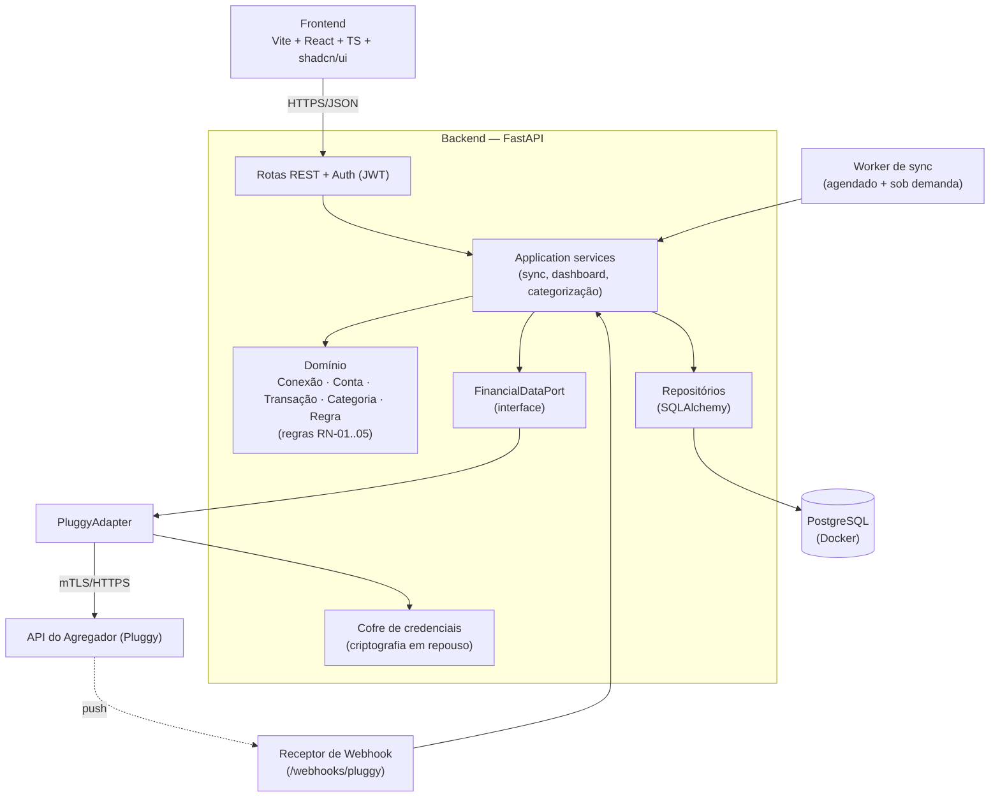

# ARCHITECTURE — Consolida

## Estilo

Arquitetura **hexagonal (Ports & Adapters)**. O núcleo de domínio (entidades + regras) não conhece HTTP, Postgres nem Pluggy. Tudo externo entra por uma *Port*. O domínio espelha o **modelo canônico do Open Finance** (Conexão/Consentimento → Conta → Saldo → Transação), o que torna o Pluggy um detalhe substituível e prepara um eventual adapter "Open Finance direto".

## Diagrama de componentes

## Decisões e o porquê

- **Port/Adapter com domínio espelhando o Open Finance** (ADR-002): o documento de referência das APIs do Open Finance vira a especificação da `FinancialDataPort`. Trocar Pluggy → outro agregador (ou OF direto) = implementar um adapter, sem tocar no núcleo. Atende NFR-006.
- **Cofre de credenciais** (ADR-005): tokens/credenciais do agregador são cifrados em repouso (ex.: `pgcrypto` ou Fernet com chave em env/secret manager) e nunca logados/retornados. Atende NFR-001.
- **Worker de sync separado das rotas** (FR-022/023): sincronização roda fora do ciclo de request, com backoff em 429/529/5xx (NFR-004). Sob demanda e agendado usam o mesmo serviço.
- **Webhook opcional**: o agregador pode notificar mudança de estado de uma conexão; o receptor valida e dispara sync incremental, reduzindo polling.
- **Isolamento por `user_id` desde o MVP** (ADR-003): single-user na prática, mas todas as tabelas e queries já filtram por `user_id` — multi-tenant é "ligar a chave", não reescrever (NFR-007).
- **12-factor / Docker** (NFR-010): backend + Postgres em containers; config por env.

## Fluxo de sincronização (resumo)

1. Gatilho (botão, job agendado ou webhook) → `SyncService.sync(connection_id)`.
2. Adapter busca contas e transações desde o último cursor/`last_sync_at`.
3. Domínio normaliza (RN-01), deduplica por `(connection_id, provider_transaction_id)` (RN-05), aplica categoria (provider → regra → fallback).
4. Persiste em transação atômica por conta; atualiza `last_sync_at` e status.
5. Em expiração de consentimento → status `requer_reauth` (RN-03).
