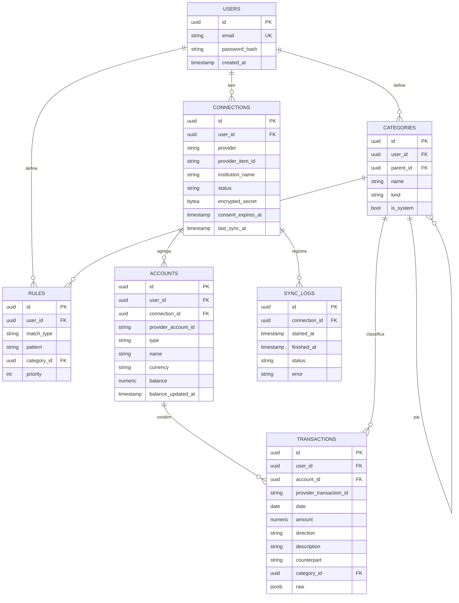

# DATA_MODEL — Consolida

Modelo espelha o canônico do Open Finance. **Tudo é escopado por `user_id`** (multi-tenant-ready).

## Diagrama ER

## Dicionário de dados (campos não-óbvios)

| Tabela.campo | Notas |
|---|---|
| `connections.provider` | Identifica o adapter (`pluggy`, futuro `openfinance`, `belvo`). |
| `connections.provider_item_id` | ID do vínculo no agregador (no Pluggy: *Item*). |
| `connections.status` | `ativa` · `requer_reauth` · `erro` (RN-03). |
| `connections.encrypted_secret` | Token/credencial do agregador cifrado em repouso (NFR-001). Nunca exposto via API. |
| `connections.consent_expires_at` | Validade do consentimento (≤ 12 meses). |
| `accounts.type` | `checking` · `savings` · `payment` · `credit_card`. Cartão entra como passivo (RN-02). |
| `transactions.direction` | `in` (crédito) · `out` (débito). Derivado do sinal do `amount` (RN-01). |
| `transactions.provider_transaction_id` | Parte da chave de dedupe `(connection_id, provider_transaction_id)` (RN-05). |
| `transactions.raw` | Payload original do agregador (auditoria/reprocesso). Sem expor cru na API. |
| `transactions` | Imutável após import; só `category_id` muda na recategorização (RN-04). |
| `categories.is_system` | Categorias padrão do sistema (`user_id` nulo) vs. do usuário. |
| `categories.kind` | `income` · `expense` · `transfer`. |
| `rules.match_type` | `contains` · `equals` · `regex`. Aplicadas por `priority`. |

## Índices essenciais (NFR-005 / NFR-007)

- `transactions (user_id, date)`, `transactions (account_id, date)`
- `UNIQUE (connection_id, provider_transaction_id)`
- `accounts (user_id)`, `connections (user_id)`
