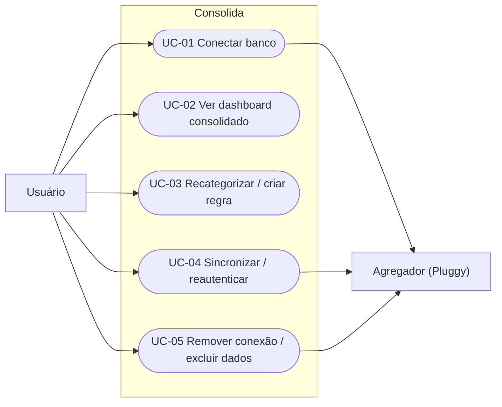

# USE_CASES — Consolida

## Diagrama de casos de uso



## UC-01 — Conectar banco
**Atores:** Usuário, Agregador. **Cobre:** FR-003, FR-007.

```gherkin
Funcionalidade: Conectar um banco
  Cenário: Conexão bem-sucedida
    Dado que estou autenticado e na tela de conexões
    Quando inicio uma nova conexão e seleciono meu banco no widget do agregador
    E concluo o consentimento no fluxo do banco
    Então uma Conexão é criada com status "ativa"
    E a primeira sincronização traz minhas contas e transações

  Cenário: Consentimento cancelado
    Dado que iniciei uma conexão
    Quando cancelo o consentimento no banco
    Então nenhuma Conexão ativa é criada
    E vejo uma mensagem de que a conexão não foi concluída
```

## UC-02 — Ver dashboard consolidado
**Atores:** Usuário. **Cobre:** FR-009, FR-018, FR-019, RN-01, RN-02.

```gherkin
Funcionalidade: Dashboard de entradas e saídas
  Cenário: Resumo do período
    Dado que tenho contas conectadas com transações
    Quando seleciono um período no dashboard
    Então vejo total recebido, total gasto e saldo líquido do período
    E vejo o gasto por categoria
    E o saldo consolidado não soma cartão de crédito como saldo positivo
```

## UC-03 — Recategorizar / criar regra
**Atores:** Usuário. **Cobre:** FR-014, FR-015, FR-017, RN-04.

```gherkin
Funcionalidade: Categorização
  Cenário: Recategorizar e criar regra
    Dado que uma transação está em "Outros"
    Quando a recategorizo para "Alimentação"
    E marco "aplicar a transações futuras com a mesma descrição"
    Então a transação fica em "Alimentação"
    E uma regra é criada para futuras transações correspondentes
    E a origem original da transação é preservada
```

## UC-04 — Sincronizar / reautenticar
**Atores:** Usuário, Agregador. **Cobre:** FR-005, FR-022, FR-023, RN-03, RN-05.

```gherkin
Funcionalidade: Sincronização
  Cenário: Atualização sob demanda
    Dado que tenho uma conexão ativa
    Quando clico em "atualizar"
    Então novas transações são importadas sem duplicar as já existentes

  Cenário: Consentimento expirado
    Dado que o consentimento da conexão expirou
    Quando a sincronização roda
    Então a conexão passa a "requer_reauth"
    E sou avisado para reautenticar
```

## UC-05 — Remover conexão / excluir dados
**Atores:** Usuário, Agregador. **Cobre:** FR-006, NFR-003.

```gherkin
Funcionalidade: Direito ao esquecimento
  Cenário: Remover conexão
    Dado que tenho uma conexão ativa
    Quando solicito a remoção da conexão
    Então a conexão é revogada no agregador
    E todas as contas, transações e tokens associados são apagados
```
